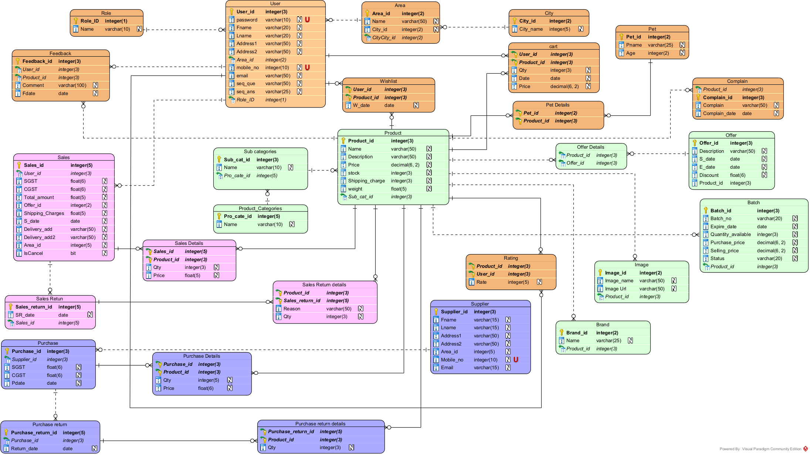

# 🐾 Pet Shop E-Commerce Platform with AI Assistant

A full-stack, feature-rich E-Commerce platform for pet products featuring a **Hybrid AI Assistant** powered by Google Gemini. It seamlessly integrates traditional e-commerce capabilities with an intelligent chatbot that remembers user preferences and assists in product discovery.

---

## 📊 Database Architecture (ER Diagram)

> Here is the Entity-Relationship Diagram showing the complete database schema including Products, Categories, Users, Orders, and Chatbot Context memory:



---

## ✨ Key Features

- 🛒 **E-Commerce Operations:** Browse products, filter by categories & brands, add to cart, and checkout.
- 🤖 **Hybrid AI Chatbot:**
  - **Memory System:** Remembers user preferences (pet type, preferred brands, price range).
  - **Database Integration:** Direct queries for FAQs, Categories, and Brands for instant responses.
  - **Multimodal (Vision):** Accepts image inputs to identify pet products via Gemini AI.
  - **Fallback System:** Automatic model fallback (`gemini-2.5-flash-lite` -> `gemini-2.0-flash`) with retry handling for 429 errors.
- 📱 **Custom Routing Links:** Interactive chatbot replies with clickable app navigation routes (`route:product:id`).

---

## 🛠️ Tech Stack

- **Frontend:** React.js (Vite) + CSS/Tailwind
- **Backend:** Node.js + Express.js
- **Database:** SQL / MySQL
- **AI Integration:** Google Generative AI SDK (Gemini API)

---

## ⚙️ Chatbot Architecture Flow

1. **User Message Received:** Captures text and optional image input.
2. **Context Memory Update:** Extracts key entities (e.g., "dog", "pedigree") and stores user preferences in SQL database.
3. **Waterfall Decision Tree:**
   - Check **Database FAQs** ➡️ If found, reply immediately.
   - Check **Brand/Category Intent** ➡️ If matched, return dynamic route links.
   - Check **Smart Product Filter** ➡️ Match products based on saved user context.
   - **Gemini AI Engine** ➡️ If no DB match, forward chat history + context to Gemini API.

---

## 🚀 Getting Started

### 1. Backend Setup
```bash
cd backend
npm install
npm start

cd frontend
npm install
npm run dev